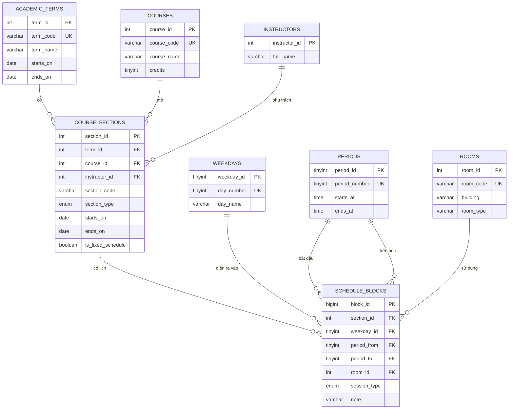

# Thiết kế database thời khóa biểu

Đây là sơ đồ cơ sở dữ liệu quan hệ cho thời khóa biểu. Sơ đồ được viết bằng Mermaid nên GitHub có thể vẽ trực tiếp từ code Markdown, không cần tạo hay lưu ảnh.

## 1. Sơ đồ ER



## 2. Ý nghĩa thiết kế

| Bảng | Chức năng |
|---|---|
| `academic_terms` | Lưu học kỳ và khoảng thời gian của học kỳ |
| `courses` | Danh mục môn học, mã môn, tên môn, số tín chỉ |
| `instructors` | Danh sách giảng viên |
| `rooms` | Danh sách phòng hoặc sân học |
| `weekdays` | Các ngày trong tuần |
| `periods` | 10 tiết học, giờ bắt đầu và kết thúc |
| `course_sections` | Lớp học phần cụ thể trong một học kỳ |
| `schedule_blocks` | Lịch của lớp: thứ, tiết bắt đầu, tiết kết thúc, phòng |

## 3. Vì sao `schedule_blocks` có `period_from` và `period_to`?

Một thẻ môn trong giao diện có thể chiếm nhiều tiết liên tiếp. Ví dụ:

```text
period_from = 1
period_to   = 5
```

Khi render ra giao diện HTML, khoảng này được đổi thành `rowspan="5"`. Như vậy database lưu dữ liệu gọn hơn, còn HTML chịu trách nhiệm trình bày thành các ô gộp hàng.

## 4. View lấy dữ liệu cho giao diện

View `v_timetable` nối các bảng lại thành dữ liệu dễ dùng cho frontend:

```sql
SELECT day_name, period_from, period_to,
       course_code, course_name,
       instructor_name, room_code
FROM v_timetable
WHERE is_fixed_schedule = TRUE
ORDER BY day_number, period_from, course_code;
```

Lớp không có giờ cố định được lọc bằng `is_fixed_schedule = FALSE` để hiển thị ở khu vực riêng bên dưới bảng.

## 5. File SQL

- [`database/schedule_schema.sql`](../database/schedule_schema.sql): tạo database, bảng, khóa ngoại và view.
- [`database/schedule_seed.sql`](../database/schedule_seed.sql): dữ liệu mẫu khớp với các môn trong `schedule.html`.
